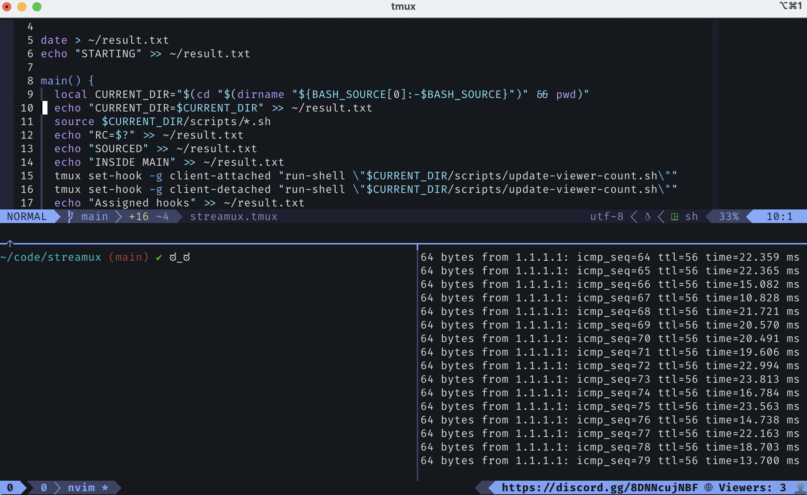
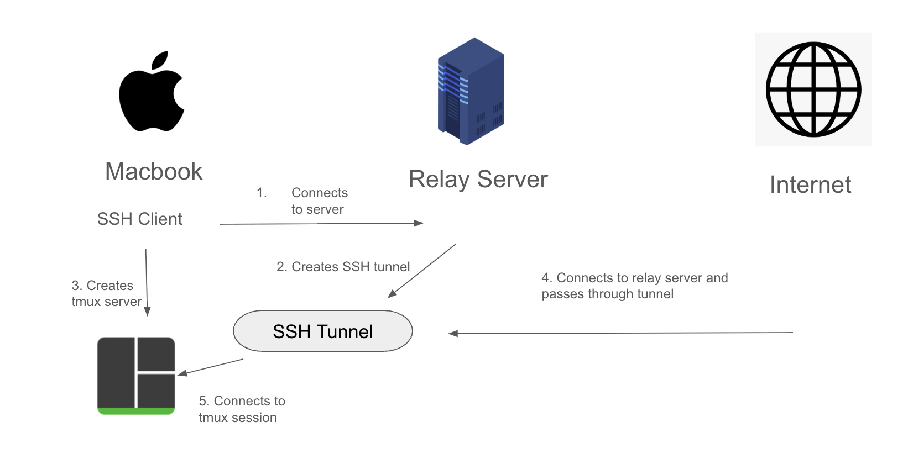

# streamux
Streaming your tmux session to the masses.

Have you ever wanted to be a professional streamer, but you didn't want to talk,
show your face, and you just wanted to share your tmux session? Now you can! People can from around
the world can share in your tmux session.




## How to watch

You don't need any software beyond ssh. Run
```
ssh tmuxview@streamux.svenxix.net
```
The password is `HelpfulVillainSleekEmblaze`

You can quit by typing
```
ctrl+b d
```

I don't have the streaming on very often so you will likely timeout unless
you get into the very narrow window when I am available. 

You are welcome to get in touch with me on my discord. 

https://discord.gg/8DNNcujNBF


## Motivation

I've been using tmux as my daily driver for several years now and it's wonderful.
I'm still finding out new and exciting things about it. Recently, I discovered
that you can have multiple people share the same tmux session. This got me
thinking if it was possible to do it over ssh. Since it's just a unix socket
it doesn't have any ssh capabilities, but you can add an ssh server and hook
it up to your tmux session.

This got me thinking about professional twitch streamers who work on code
in front of an anonymous audience of thousands, but instead of having people
watch a video stream they were connected to your tmux stream.

This was a terrible idea. I knew I had to do it.

There are many other solutions that would work better than this. Zoom, google
meet, discord. With those you share your whole screen plus audio and video.
But that's not what I wanted to do. I wanted to share my tmux session on my
macbook while I recreationly code in the evenings.

## Prior art

Unsurprisngly, there isn't much in the way of other people allowing others
to SSH into your machine and connect to your tmux session. There are many 
solutions that allow you to publish your terminal to a web page then clients
just look at it through a web browser. That works well and has less security
implications because no one is actually logged into your machine. I'll list
a couple of them:

- https://github.com/tsl0922/ttyd
- https://github.com/yudai/gotty
- https://github.com/elisescu/tty-share

Much closer to what I'm looking for are these two open-source services/programs:
tmate and upterm.

Tmate (https://github.com/tmate-io/tmate) is a fork of tmux that is designed
to share over SSH. At one point it included a service that would relay your
connection and expose it to the internet. Unfortunately this project has 
been abandoned. The fork never kept up with the upstream tmux. The servers
were eventually shutdown.

Upterm (https://github.com/owenthereal/upterm) took a different approach. It
was written by a solo developer who works at Heroku who wanted an easy way
to pair program. Instead of forking tmux, he wrote a separate go program that
creates a reverse ssh tunnel to a relay server. By keeping it separate from
tmux he didn't need to worry about keeping up with upstream. Also it shares the
whole terminal and not just tmux. The service is
still live at https://upterm.dev/. You can also self-host.

This was almost exactly what I was looking for, but upterm is about 
letting one or two people you trust into your machine. I wanted to
let a bunch of people I don't trust in. I was also wondering if I
could do it without any extra software. I was successful.

## Architecture

There are two main parts to this, the macbook you want to stream from, and a relay server
that will provide you with a static hostname/ip address that will also allow you
to bypass your NAT/router/firewall.



Your macbook will connect to the relay server, which will then create an SSH tunnel back to your
macbook. Anyone connecting to port 22 on the relay server will be forwarded to port 22 on your
macbook. On your macbook you will start a tmux server which writes to a shared unix socket.

Your audience will connect to the relay server on port 22, get forwarded to port 22 on your
macbook, and establish an SSH session. However, this SSH session is not interactive and will
have limited permissions. It will only start a tmux client and connect to the shared unix
socket in read-only mode. Then your clients can watch you stream.


## Installation Instructions

### Macbook

The goal is to enable SSH and make it as locked down as possible.

First, enable SSH
```
Go to System Settings => Sharing => Toggle `Remote Login`
```

Next create a user specifically for this purpose. In this tutorial
we're going to call it `tmuxview`.

```
Go to System Settings => Genreal => Users & Groups => Add User => tmuxview
```

Enable SSH for this user. 

```
Go to System Settings => General => Sharing => Remote Logon => Click the 'i' => allow users tmuxview
```

Create a shared group.

```
System Settings => General => Users & Groups => Add Group => tmux-share
```

Add both your main user and your tmux viewer to the group
```
System Settings => General => Users & Groups => Click on the 'i' next to the group 'tmux-share' => Add both your main user and tmuxview to the group
```

Tmux works based off of unix sockets so you will need a shared socket object
that both of the users can connect to.

Create the directory to share the sockets
```
sudo mkdir /var/run/tmux
```

Make the tmux-share group the owner. In my case my primary account is donovan
and I still want to own it.

```
sudo chown donovan:tmux-share /var/run/tmux
```

The `tmuxview` user will not get an interactive shell when they connect. Instead
it is force to run a command. Copy the `join-session.sh` script from this repo to
`tmuxview` user's home directory.

```
cp join-session.sh /Users/tmuxview
```

Make sure it's executable
```
chmod +x /Users/tmuxview/join-session.sh
```

Now we need to configure and lock down ssh. Open `/etc/ssh/sshd_confg` with admin
priveleges and make sure the following values are set.

```
PermitTunnel no

ForceCommand /Users/tmuxview/join-session.sh

Banner /etc/banner

AllowUsers tmuxview
```

This makes sure that only the `tmuxview` user can connect via ssh.
They are forced to run the join-session.sh script instead of an interactive shell.
It also displays the message in the text file `/etc/banner` when a user connects
before they enter their password. Take a minute now to create that file
and write something nice.

Restart sshd on macbook
```
sudo launchctl kickstart -k system/com.openssh.sshd
```

This repo comes with an optional add-on. A tmux plugin that will notify you
of how many viewers are currently connected to your stream. In the tmux
right-hand status bar.

To install in, copy the `tmux-plugin` folder somewhere on your hard drive.
Then in your tmux config add the line 
```
run-shell "~/code/dotfiles/tmux/plugins/streamux/streamux.tmux"
```

Or you could use tpm. 

Additionally there is a text file with a message that gets prepended to
the right-status bar. I use it to advertise my discord server. You
can customize it by changing the text file, `discord.txt`


## Relay server
For this to work you will need a relay server that is exposed to the internet
and has a static hostname or ip address. I personally am using a Digital Ocean
droplet, but there are many cloud providers out there who will provide a
comparable service for a small, monthly fee.

Create your server. I'm using Ubuntu 24.04.

First, you need to lock down your server.

Edit /etc/ssh/sshd_config to have the following lines.
```
PasswordAuthentication no

PermitRootLogin no

# This allows the reverse port to be exposed to 0.0.0.0 and not just localhost
GatewayPorts yes
```

Change the server's management SSH port to a non-standard port.

Edit `/etc/systemd/system/sockets.target.wants`
Make sure the line `ListenStream` is set to a port you want. In this instance I will
pick port 42069.

```
[Unit]
Description=OpenBSD Secure Shell server socket
Before=sockets.target ssh.service
ConditionPathExists=!/etc/ssh/sshd_not_to_be_run

[Socket]
ListenStream=42069
Accept=no 
FreeBind=yes 

[Install]
WantedBy=sockets.target
RequiredBy=ssh.service
```

Reload the config.
```
sudo systemctl daemon-reload
```

Restart the socket
```
sudo systemctl restart ssh.socket
```

Restart the ssh service
```
sudo systemctl restart ssh
```

Now you should have your management port somewhere non-standard so bots
don't break down your door.

Next you need to reroute traffic from port 22 to port 2222. Port 2222 will
be the port used for your ssh tunneling because the user doesn't have rights
to create a listening port on 22. Instead we will use iptables to redirect all
port 22 traffic to port 2222.

In order to do that we need the package iptables-persistent.
```
sudo apt update 
sudo apt install iptables-persistent
```

Edit the file `/etc/iptables/rules.v4`

```
*nat
:PREROUTING ACCEPT [0:0]
:INPUT ACCEPT [0:0]
:OUTPUT ACCEPT [0:0]
:POSTROUTING ACCEPT [0:0]

-A PREROUTING -p tcp --dport 22 -j REDIRECT --to-ports 2222

COMMIT

*filter
:INPUT ACCEPT [0:0]
:FORWARD ACCEPT [0:0]
:OUTPUT ACCEPT [0:0]

-A INPUT -p tcp --dport 4312 -j ACCEPT

COMMIT
```

Reload the config.
Reload the rules
```
sudo netfilter-persistent reload
```

At this point you should go to your cloud provider and make sure your
firewall is configured. You should allow port TCP 22 from anywhere and
only allow port 42069 (or whatever port you picked) from your home address.

## Running a streamux server

At this point you have your macbook configured and your relay server is ready.

Use the script `start-reverse-shell.sh to connect to your relay server and setup
the ssh tunnel. You will need to modify the script to have the correct hostname.

```
bash start-reverse-shell.sh
```

Now you're ready to start streaming! Run this script to start tmux.
```
bash start-streaming.sh
```

At this point I should put a caveat. I've done my best to mitigate the
risks of having the internet ssh into your macbook, but you're still
letting random people into your house.


