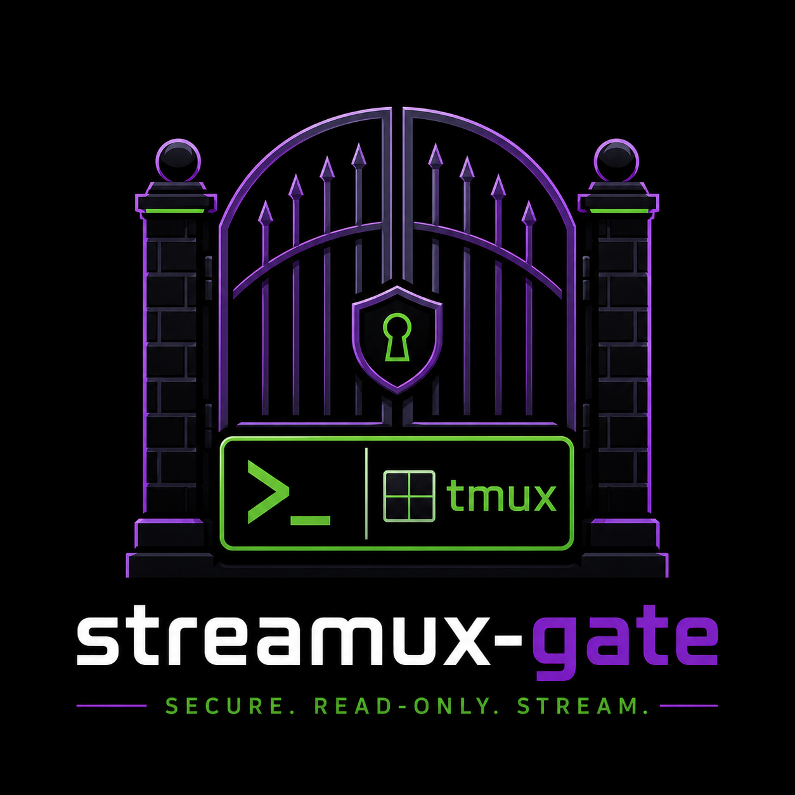

# Streamux-Gate

Streamux-gate is a more secure and production-ready way to host tmux streaming.
It uses (charm's wish)[https://github.com/charmbracelet/wish] ssh app library
to make a custom ssh server.

# Features
* Bypasses all authentication so end users don't need to know a username/password.
* Detailed logging.
* Runs as a service on your MacBook
* Doesn't run a shell.
* Blocks all keystrokes to tmux other than the escape sequence

# Installation

# Todo
* Configurable socket address
* Configurable tmux location
